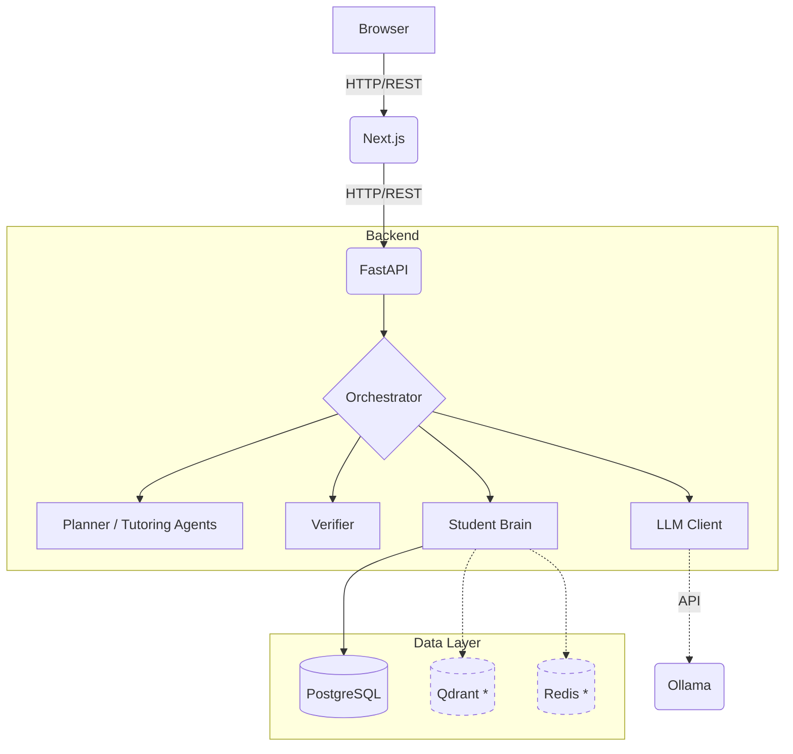

# MentorAI

MentorAI is an AI-powered Socratic tutor designed to teach through guided reasoning rather than simply providing answers. 

The core philosophy is simple:
- The tutor should teach, not just answer.
- Problems are decomposed into prerequisite concepts.
- Learning proceeds through checkpoints.
- Student responses are verified.
- Misconceptions are detected.
- Hints become progressively stronger.
- Progression is unlocked by demonstrated understanding.
- Learning contributes to a persistent Student Brain.

## 1. What is MentorAI?

MentorAI is an open-source, full-stack learning platform. It integrates fine-tuned local Large Language Models (LLMs) with an orchestrator backend to simulate the Socratic method for students. 

Currently supported learning domains:
- Mathematics
- Programming
- Data Structures & Algorithms
- Computer Science fundamentals

### The Tutoring Loop
The system operates through an orchestrated agent loop:

Student 
→ Planner 
→ Learning Plan 
→ Checkpoint 
→ Student Response 
→ Verifier 
→ Feedback / Hint 
→ Mastery Update 
→ Next Checkpoint

An Orchestrator coordinates these steps, ensuring the student cannot advance until they've demonstrated genuine understanding.

## 2. Core System

The architecture is split into distinct components:
- **Planner:** AI agent that maps a student's learning goal into concrete, sequential checkpoints.
- **Verifier:** AI agent that evaluates a student's response against a specific checkpoint, identifying correctness and misconceptions.
- **Hint/Tutoring Logic:** Dynamically generates progressively stronger hints based on the student's misconceptions and attempt count.
- **Orchestrator:** The central state machine directing the flow between the student, the AI agents, and the persistent memory.
- **Student Brain:** The long-term memory system tracking mastery, misconceptions, and learning history.
- **PostgreSQL:** Relational database for persistent Student Brain storage.
- **Qdrant:** Provisioned vector database intended for semantic memory retrieval.
- **Redis:** Provisioned in-memory data store intended for ephemeral caching.
- **FastAPI:** High-performance Python backend serving the Orchestrator via REST.
- **Next.js:** React-based frontend providing the chat interface and learning dashboard.
- **Ollama / LLM Backend:** The local inference engine running the underlying language model.

## 3. Architecture


*\* Note: Qdrant and Redis infrastructure is provisioned, but application-level integration remains partial/mocked.*

## 4. Current Status

The project is moving from infrastructure stabilization toward its next model-training cycle.

| Phase | Category | Status |
|---|---|---|
| **Phase 1-5** | Data & Agent Schemas | **Implemented** |
| **Phase 6** | Student Brain | **Implemented / Audited** |
| **Phase 7** | Backend API | **Implemented / Audited** |
| **Phase 8** | Web Frontend | **Implemented / Audited** |
| **Phase 9** | Model Training | **Planned (Next Step)** |

**Verified Capabilities & Limitations:**
- PostgreSQL relational persistence is implemented.
- Student Brain persistence has been verified.
- FastAPI backend is implemented.
- Next.js frontend is implemented and builds successfully after lint/type fixes.
- Qdrant infrastructure exists but application-level semantic memory integration remains partial.
- Redis infrastructure exists but runtime usage remains partial.
- Full repository test suite still contains failures associated with the missing `training` module/tests.
- Docker/Ollama live integration could not be verified in the automated audit environment due to missing dependencies on the test host.

## 5. Technology Stack

| Layer | Technology | Purpose |
|---|---|---|
| **Application** | Python, FastAPI, SQLAlchemy, Alembic | Backend framework and ORM |
| **AI** | Ollama, Custom Agents | Local inference and structured Pydantic agent schemas |
| **Persistence** | PostgreSQL, Qdrant, Redis | Relational storage, Vector DB, and Ephemeral Cache |
| **Frontend** | Next.js, React, TypeScript, Tailwind CSS, shadcn/ui | UI Framework and components |
| **Testing** | pytest, npm (lint/build) | Backend unit tests and frontend static analysis |
| **Infrastructure** | Docker, Docker Compose | Containerization and orchestration |

## 6. Quick Start

**Prerequisites:** Git, Docker, Docker Compose, Ollama.

1. **Clone the repository:**
```bash
git clone <your-repo-url> Maieutic
cd Maieutic
```

2. **Start the local LLM via Ollama (on the host):**
```bash
ollama serve
ollama pull qwen2
```
*(Note: Replace `qwen2` with your preferred model. Ollama runs on your host machine while the API runs inside Docker).*

3. **Configure the environment:**
```bash
cp .env.example .env
```
Ensure your `.env` specifies the host gateway so the Docker container can reach Ollama. For example:
```env
LLM_BASE_URL=http://host.docker.internal:11434/v1
LLM_MODEL=qwen2
```

4. **Start the infrastructure:**
```bash
docker compose up --build
```

**Services:**
- **Frontend:** http://localhost:3000
- **API:** http://localhost:8000
- **Swagger Docs:** http://localhost:8000/docs

## 7. Common Commands

- **Start:** `docker compose up`
- **Build & Start:** `docker compose up --build`
- **Start Detached:** `docker compose up -d`
- **Stop:** `docker compose down`
- **View API Logs:** `docker compose logs -f api`
- **View Container Status:** `docker compose ps`
- **Validate Compose File:** `docker compose config`
- **Run Backend Tests:**
  ```bash
  PYTHONPATH=/workspace/Maieutic/apps/api pytest tests/agents -v
  PYTHONPATH=/workspace/Maieutic/apps/api pytest tests/api -v
  ```
- **Run Frontend Checks:**
  ```bash
  cd apps/frontend
  npm run lint
  npm run build
  ```
- **Database Migrations (Alembic):**
  ```bash
  alembic current
  alembic history
  alembic upgrade head
  ```

> [!WARNING]
> Running `docker compose down -v` is destructive. It removes all persisted development volumes (Postgres data).

## 8. Student Brain

The Student Brain is MentorAI's central persistence layer. It stores:
- Student profiles
- Learning sessions
- Checkpoint state and progression
- Mastery state (concept-level scores)
- Verification history (attempts and feedback)
- Misconceptions observed
- Revision scheduling

**PostgreSQL** serves as the primary source of truth, managing relational links between sessions, attempts, and mastery. A persistence guarantee has been verified for mastery and sessions across API/DB restarts.
**Qdrant** is provisioned to eventually store vector embeddings for semantic retrieval (e.g., finding conceptually similar past struggles), but integration is currently mocked.

## 9. API

The FastAPI application provides standard REST endpoints consumed by the frontend. Swagger UI is available at `/docs`.

Current primary endpoints:
- `POST /api/chat` - Submits a student response to the Orchestrator.
- `GET /api/session/{id}` - Retrieves learning session state.
- `GET /api/brain/{user_id}` - Fetches the student's mastery profile.
- `GET /api/revision/{user_id}` - Fetches concepts needing revision.

For more details, see [docs/api.md](docs/api.md).

## 10. Frontend

The Next.js frontend delivers the interactive tutoring experience:
- **Chat Interface:** Primary interaction window where the student answers questions and receives Socratic hints.
- **Learning Plan Sidebar:** Visualizes the current goal, decomposed checkpoints, and progression status.
- **Mastery Dashboard:** Renders the student's historical mastery metrics and identified misconceptions across concepts.

## 11. Development

The codebase is organized into domain-specific applications:
- `apps/api/` - The FastAPI backend service.
- `apps/frontend/` - The Next.js frontend application.
- `agents/` - (Integrated into the backend) Core LLM interaction logic.
- `tests/` - Backend test suite.
- `docs/` - Project documentation.

When working on the project, note the distinction between documentation types:
- **Product/Architecture:** E.g., `system_architecture.md`, `student_brain.md`.
- **Operations:** E.g., `getting-started.md`, `troubleshooting.md`.
- **Phase documentation:** Historical records of what was built (e.g., `phases.md`).

For detailed contribution guidelines, see [docs/development.md](docs/development.md) and [docs/getting-started.md](docs/getting-started.md).

## 12. Testing

The repository relies on several testing strategies:
- **Agent tests:** Unit tests validating Pydantic schemas and LLM clients.
- **API tests:** Integration tests for FastAPI endpoints.
- **Frontend static checks:** `eslint` and TypeScript compilation (`npm run build`).
- **Persistence verification:** Ensuring data survives database restarts.

*Note: The full repository suite currently exhibits failures due to a missing `training` module that breaks an orphaned `pipeline` test suite. We do not claim 100% test success until this is resolved.*

See [docs/testing.md](docs/testing.md) and [docs/verification/phase-6-8-verification.md](docs/verification/phase-6-8-verification.md) for full context.

## 13. Troubleshooting

Common issues during development:
- **API cannot reach Ollama:** Ensure `LLM_BASE_URL` uses the correct host IP or `host.docker.internal` instead of `localhost`.
- **Port already in use:** Verify you aren't running local instances of Postgres on `5432` outside Docker.
- **Database Connection:** Ensure you ran migrations with Alembic before starting the API.
- **Missing `training` module:** Ignore `pytest tests/pipeline/` failures until the module is restored/deleted.
- **Resetting state:** Use `docker compose down -v` to wipe the DB.

See [docs/troubleshooting.md](docs/troubleshooting.md) and [docs/ollama.md](docs/ollama.md).

## 14. Documentation Index

- [README.md](README.md) (This file)
- [Getting Started](docs/getting-started.md)
- [System Architecture](docs/system_architecture.md)
- [Student Brain](docs/student_brain.md)
- [API Documentation](docs/api.md)
- [Database Schema](docs/database.md)
- [Ollama Setup](docs/ollama.md)
- [Docker Setup](docs/docker.md)
- [Testing Guide](docs/testing.md)
- [Troubleshooting](docs/troubleshooting.md)
- [Project Status](docs/PROJECT_STATUS.md)
- [Phase 6-8 Verification](docs/verification/phase-6-8-verification.md)
- [Phase History](docs/phases.md)

## 15. Roadmap / Next Step

The architecture is in place for the next major milestone.

- **Phase 6:** Student Brain / persistence (Completed)
- **Phase 7:** Backend API (Completed)
- **Phase 8:** Web frontend (Completed)
- **Next Step:** Model training / retraining

The core infrastructure is now stable. The focus shifts to transforming the Phase 1 dataset into a true Socratic format and running Experiment #2.

## 16. Project Status / Limitations

**Known Limitations (Verified in Phase 6-8 Audit):**
- Qdrant (Semantic Memory) and Redis (Caching) are provisioned in infrastructure but their integration remains partial/mocked in the application code.
- The `tests/pipeline/` suite currently fails due to a missing `training` module that was either accidentally removed or belongs to a future phase.
- The API currently lacks robust production authentication or rate-limiting protocols.
- The underlying LLM (Experiment #1 adapter) is not yet fully capable of Socratic tutoring; Experiment #2 retraining is required for functional capability.
