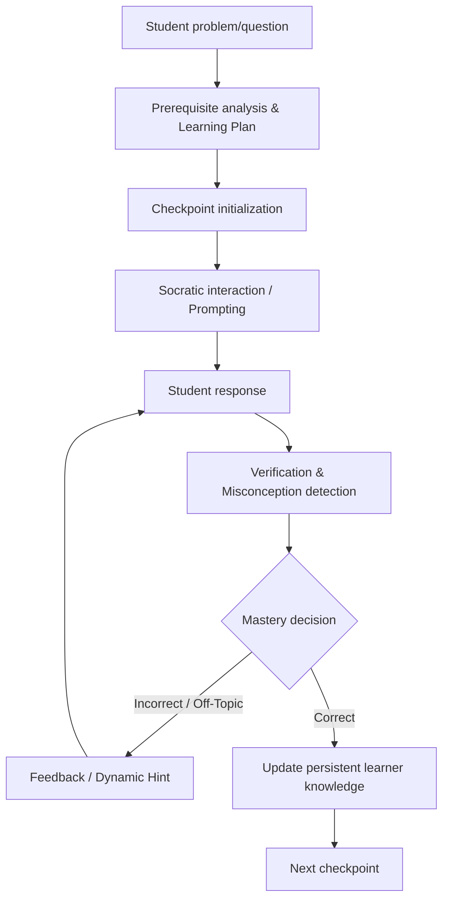

# Maieutic: Project Overview

============================================================
1. PROBLEM STATEMENT
============================================================

Conventional AI assistants and traditional LLM-based educational systems fundamentally misunderstand the objective of tutoring. When a student struggles with a problem, conventional AI systems default to "giving the student an answer." This approach satisfies immediate user intent but circumvents the cognitive struggle required for genuine learning. The difference between giving an answer and "helping the student develop the ability to derive the answer" is the difference between an answering machine and a tutor.

Maieutic addresses specific failures in conventional educational AI, which include:

- **Direct-answer behavior:** Standard LLMs lack the pedagogical restraint required to withhold the answer while guiding the student to discover it.
- **Lack of verification of student understanding:** Traditional bots accept any coherent input as understanding. They cannot rigorously evaluate whether a response demonstrates genuine mastery of the underlying concept.
- **Inability to distinguish correct reasoning from guessing:** Without explicit evaluation criteria, AI cannot determine *why* a student got something right.
- **Insufficient misconception detection:** Educational models often miss flawed underlying assumptions when the surface answer appears correct.
- **Weak personalization & static tutoring flows:** Chatbots typically rely on system prompts for "Socratic" behavior, resulting in shallow, repetitive hint cycles that do not dynamically adjust to the learner's evolving state.
- **Lack of prerequisite reasoning:** Knowledge is built sequentially. If a student cannot solve an algebra problem because they misunderstand fractions, addressing algebra directly is futile. Traditional LLMs do not inherently decompose problems into prerequisite graphs.
- **Lack of persistent learner knowledge:** Most AI interactions are stateless. Once a session ends, the AI forgets the student's mastery profile, leading to generic responses in future interactions that do not adapt to demonstrated mastery.

**Formal Problem Statement:**
Current conversational AI models prioritize immediate problem resolution over cognitive skill acquisition and lack persistent, structured representations of student mastery. There is a critical need for an orchestrated system that decomposes learning goals into prerequisite checkpoints, restrains the LLM from providing direct answers, rigorously verifies student responses against specific criteria, detects underlying misconceptions, and maintains a persistent, evolving profile of the student's conceptual mastery over time.

============================================================
2. AIM
============================================================

The overall aim of Maieutic is to function as a genuine Socratic tutor that orchestrates the learning process rather than simply acting as an interactive encyclopedia. It is intended to systematically guide students through prerequisite concepts, validating genuine understanding at each step, and maintaining a persistent memory of the student's cognitive state.

The intended tutoring loop follows a structured, orchestrated flow:



### Role of System Components

- **Planner (Implemented):** An AI agent that maps a student's learning goal into a validated Directed Acyclic Graph (DAG) of concrete, sequential checkpoints and prerequisite concepts.
- **Verifier/Judge (Implemented):** An AI agent that evaluates a student's response against a specific checkpoint's success criteria. It determines correctness, calculates a mastery score, and explicitly identifies misconceptions.
- **Hint generation / Tutor (Implemented):** Dynamically generates progressively stronger hints (scaling from subtle nudges to direct explanations) based on the Verifier's identified misconceptions and the student's attempt count.
- **Orchestrator (Implemented):** The central state machine directing the flow between the student, the Planner, Verifier, and Hint agents. It manages the session state, incrementing hint levels upon failure, and advancing checkpoints upon success.
- **Student Brain (Implemented):** The long-term memory system tracking mastery attempts, historical mastery scores (using Exponential Moving Average), and a SuperMemo-2 inspired spaced repetition schedule for revisions.
- **Qdrant Vector Store / RAG (Partial/Planned):** Currently provisioned and collections are initialized, but deep semantic memory retrieval for application-level RAG is intended as future functionality.

============================================================
3. MODEL ARCHITECTURE
============================================================

The system relies on a specialized fine-tuned model served via a high-performance inference engine, rather than generic API providers.

### Base Model
- **Exact Base Model:** `Qwen/Qwen3-8B`
- **Model Family:** Qwen
- **Parameter Count:** 8 Billion
- **Precision/Dtype:** `bfloat16`

### Fine-Tuning
- **Methodology:** The system uses Parameter-Efficient Fine-Tuning (PEFT), specifically LoRA (Low-Rank Adaptation). 
- **Exact Hugging Face Adapter:** `NeelakshSaxena/mentorai`
- **Purpose:** The fine-tuning is explicitly designed to teach the model Socratic restraint, pedagogical scaffolding, and strict adherence to the JSON schemas required by the Planner, Verifier, and Hint agents.
- **State:** The adapter is NOT permanently merged. It is stored as standalone `.safetensors` adapter weights.

### Inference
- **Inference Server:** `vLLM` (v0.6.2)
- **Model Loading:** The base model is loaded natively, and the LoRA adapter is loaded dynamically at runtime using vLLM's `--enable-lora` capabilities.
- **API Interface:** OpenAI-compatible API exposed by vLLM on port 11434.
- **GPU Requirements:** Requires a GPU with at least 24GB VRAM (e.g., RTX 3090, RTX 4090, or A5000) to comfortably hold the 8B model weights in bf16 alongside the KV cache and LoRA adapter memory overhead.

**Model-Serving Flow:**
```text
    Qwen/Qwen3-8B (Base)
             +
    NeelakshSaxena/mentorai (LoRA Adapter)
             ↓
    vLLM Server (--enable-lora)
             ↓
    FastAPI (LLMClient)
             ↓
    Maieutic Tutoring Agents (Planner, Verifier, Hint)
```

============================================================
4. SOFTWARE REQUIREMENTS
============================================================

### Operating Environment
- **Linux/Container Environment:** The entire stack is containerized.
- **Docker & Docker Compose:** Used for orchestrating the multi-service architecture.
- **Python:** 3.12 (Backend)
- **Node.js:** 20 (Frontend)
- **Package Managers:** `poetry` (Backend), `npm` (Frontend)

### Backend
- **FastAPI & Uvicorn:** High-performance asynchronous web framework handling the API and orchestrator logic.
- **SQLAlchemy:** ORM for database interactions.
- **Alembic:** Database migration management.
- **PostgreSQL driver:** `psycopg2` / `asyncpg`
- **Redis client & Qdrant client:** Installed for caching and vector operations.
- **LLM Client:** Asynchronous HTTP client wrapping calls to the vLLM OpenAI-compatible endpoint.

### Frontend
- **Framework:** Next.js (React)
- **Language:** TypeScript
- **Runtime:** Configured for Next.js `standalone` production build.
- **API Proxy:** Next.js uses internal `rewrites()` to securely proxy frontend API calls to the internal FastAPI backend, avoiding public exposure of the backend.

### AI/ML
- **vLLM:** The core inference engine utilized for high-throughput serving and native LoRA support.
- **Hugging Face CLI:** Used dynamically in `model_bootstrap.sh` to authenticate and download the private LoRA adapter and base model to the cache.
- **CUDA Dependencies:** Required by the underlying PyTorch/vLLM images.

### Data/Infrastructure
- **PostgreSQL (v15):** The primary relational datastore for user profiles, session states, and the Student Brain.
- **Redis (v7):** In-memory datastore (provisioned as infrastructure, active utilization is partial/planned).
- **Qdrant (v1.8.4):** Vector database provisioned for semantic memory (collection initialization implemented, retrieval planned).
- **Persistent Storage:** Docker Volumes are critical for retaining the 16GB+ of Hugging Face cache weights across container restarts.

### Development / CI/CD
- **GitHub Actions:** Automates the CI/CD pipeline, building the `Dockerfile.frontend` and `Dockerfile.api` images on push to main.
- **GHCR:** GitHub Container Registry hosts the built images.

============================================================
5. HARDWARE REQUIREMENTS
============================================================

### Development Hardware
- **Frontend/Backend Development:** A standard modern laptop (8GB+ RAM) is sufficient for developing the FastAPI and Next.js layers, assuming the LLM inference is mocked or pointed to a remote API.
- **Local AI Testing:** Running the complete system locally requires a machine with at least 24GB of unified memory (e.g., Mac M2/M3 Max) or a dedicated NVIDIA GPU with 24GB VRAM (RTX 3090/4090).

### Production / RunPod Hardware
- **GPU Model / Class:** Minimum 1x RTX 3090, RTX 4090, or RTX A5000.
- **VRAM:** **24GB absolute minimum.** 
  - *Why:* The `Qwen3-8B` model in bfloat16 consumes ~16GB of VRAM. The remaining 8GB is strictly required for the vLLM KV Cache, LoRA adapter weights, and PyTorch context overhead.
- **System RAM:** 32GB minimum to handle loading weights from disk to GPU.
- **Persistent Storage:** **40GB minimum.**
  - *Why:* The Hugging Face cache must persistently store the base model safetensors and LoRA adapter (~18GB total). PostgreSQL and Qdrant data volumes require additional space. Wiping this storage causes 10-minute download penalties on every restart.
- **Network:** High-bandwidth connection for the initial multi-gigabyte model pull. Only port 3000 requires external HTTP exposure.

============================================================
6. HOW IS THE LLM / RAG UNIQUE?
============================================================

Conventional LLM tutoring is purely reactive and stateless:
```text
User asks question → LLM generates answer → User receives answer
```

Maieutic completely replaces this paradigm with a multi-agent orchestrated flow, where the LLM is decoupled into specific functional roles that execute sequentially:
```text
Student goal
     ↓
Planner (Generates structured DAG of checkpoints)
     ↓
Student attempts a checkpoint task
     ↓
Verifier (Evaluates response against rigid success criteria)
     ↓
Misconception analysis
     ↓
Orchestrator decision (Pass / Fail)
     ↓
Hint Agent (Generates progressively scaled hints if failed)
     ↓
Student Brain (Records EMA mastery score and logs misconceptions)
     ↓
Next checkpoint unlocks
```

### The Role of RAG (Retrieval-Augmented Generation)

Currently, Maieutic's implementation of the Student Brain relies heavily on **Relational State and Statistical Mastery** rather than traditional semantic RAG.

**Implemented Knowledge Management:**
Maieutic maintains a persistent representation of the learner using PostgreSQL. The Orchestrator actively reads the `ConceptMasteryState`, tracking the number of attempts, tracking specific misconceptions observed, and calculating historical mastery using an Exponential Moving Average (EMA). It also applies SuperMemo-2 algorithms to schedule revisions.

This means Maieutic does not simply retrieve generic context; it maintains a mathematical state machine of the student's cognitive profile.

**Planned Semantic RAG (Qdrant):**
While Qdrant infrastructure is provisioned and collections (`student_brain_memory`) are initialized in `student_brain.py`, the deep semantic retrieval of previous learner history to directly inject into the Planner or Hint prompts is currently labeled as **planned/future functionality**. 

When fully implemented, Maieutic's RAG will not simply be "retrieve documents → put them in the prompt." Instead, retrieved knowledge will influence:
- **Planning:** Injecting a student's past misunderstood concepts into the prerequisite graph.
- **Tutoring:** Allowing the Hint agent to reference analogies that successfully worked for the student in previous, related sessions.

### Preventing False Understanding

A critical flaw in conventional AI is assuming a student understands a concept simply because the LLM provided a good explanation and the student replied "Okay."

Maieutic prevents this through the **Verifier** agent. The Verifier is strictly constrained to evaluate the student's response against explicit `success_criteria` defined by the Planner. If the student's response does not contain the required logical components to satisfy the criteria, the Verifier rejects the attempt, logs the misconceptions, and the Orchestrator refuses to advance the checkpoint. The system structurally cannot assume understanding; understanding must be explicitly demonstrated and cryptographically validated by the Verifier.

============================================================
7. EXPECTED OUTCOME
============================================================

### Technical Outcomes
- A working, containerized, multi-agent AI tutoring platform deployable on RunPod.
- A decoupled microservice architecture ensuring the LLM inference (vLLM) runs independently of the web application layer.
- Successful runtime dynamic injection of PEFT LoRA adapters via vLLM.
- A persistent PostgreSQL-backed Student Brain tracking long-term mastery states and spaced repetition schedules.

### Educational Outcomes
- **Encourage active reasoning:** The system forces students to generate answers rather than passively reading them.
- **Provide targeted hints:** By detecting specific misconceptions and tracking attempt counts, the system escalates from subtle hints to direct guidance without frustrating the student.
- **Adapt difficulty:** By breaking problems into prerequisite checkpoints, the system guarantees students master foundational concepts before tackling complex goals.
- **Maintain continuity:** The Student Brain ensures that a student's struggles in one session inform their baseline mastery in future sessions.

### User Outcome
When a student interacts with Maieutic, they experience the following:
1. They state a learning goal.
2. The system pauses to quietly generate a learning plan, presenting the student with the first foundational checkpoint.
3. The student attempts the task.
4. The system evaluates the attempt behind the scenes. If incorrect, the student receives a gentle nudge pointing out their specific logical flaw.
5. If the student repeatedly fails, the hints become progressively more explicit.
6. Once the student demonstrates genuine understanding that satisfies the criteria, the system validates their success, updates their permanent profile, and unlocks the next logical concept in the learning journey.
